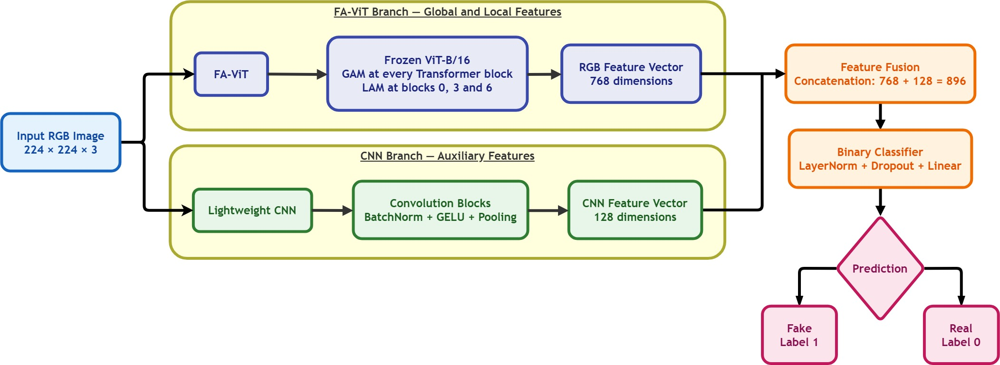
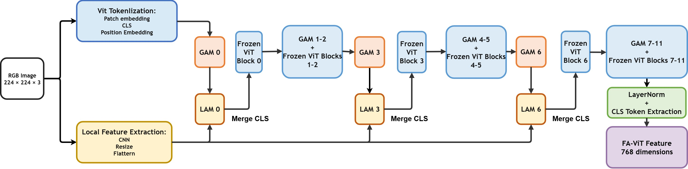
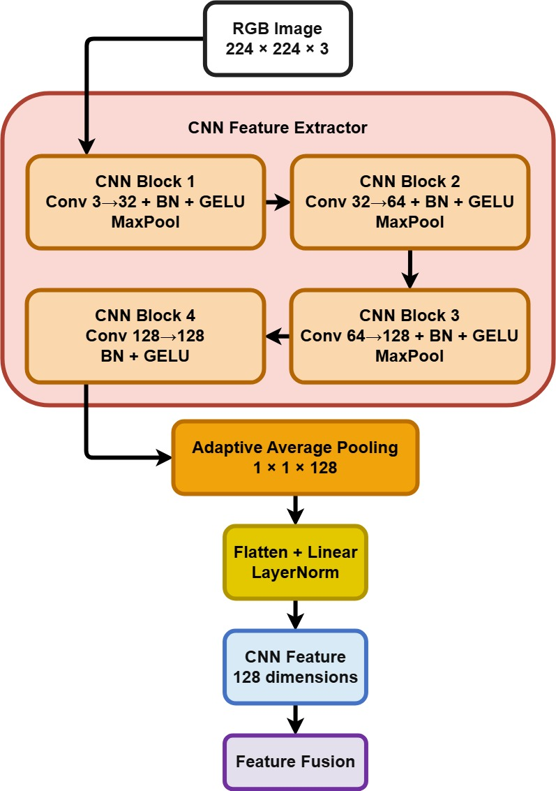

# Dual-Branch FA-ViT and CNN for Deepfake Detection

This repository provides an end-to-end pipeline for **frame-level deepfake detection**. The workflow comprises uniform frame sampling from video, MTCNN-based face detection and cropping, dual-branch model training, and both in-domain and cross-domain evaluation. The resulting model performs binary classification of facial images as either real or fake.

| Component | Description |
| --- | --- |
| Task | Binary classification of facial images |
| Labels | `real = 0`, `fake = 1` |
| Default input | RGB image of shape `224 x 224 x 3` |
| Output | A single logit; `sigmoid(logit)` represents the probability of a fake sample |
| Supported datasets | FaceForensics++ and Celeb-DF-v2 |
| Model documented here | `favit_cnn` (768-dimensional FA-ViT feature + 128-dimensional CNN feature) |

> [!IMPORTANT]
> The current [`training_model/configs/config.yaml`](training_model/configs/config.yaml) specifies `backbone: "redesigned_favit"`. To reproduce the architecture described in this document and illustrated below, change this value to `backbone: "favit_cnn"`.

## Table of Contents

- [Processing Pipeline](#processing-pipeline)
- [Repository Structure](#repository-structure)
- [Quick Start](#quick-start)
- [1. Data Preprocessing](#1-data-preprocessing)
- [2. Dataset and Data Augmentation](#2-dataset-and-data-augmentation)
- [3. FA-ViT-CNN Architecture](#3-fa-vit-cnn-architecture)
- [4. Model Training](#4-model-training)
- [5. Evaluation](#5-evaluation)
- [Limitations and Implementation Notes](#limitations-and-implementation-notes)

## Processing Pipeline

```text
FF++ / Celeb-DF-v2 videos
          |
          v
Uniform temporal frame sampling
          |
          v
Largest-face detection with MTCNN
          |
          v
Face crop + 20% margin + resizing
          |
          v
JPEG face crops organized by split and class
          |
          v
FA-ViT-CNN -> logit -> sigmoid -> real/fake
```

<p align="center">
  
</p>

<p align="center"><em>Figure 1. Overview of the dual-branch architecture. FA-ViT extracts global and local representations, while the auxiliary CNN provides complementary features. The two feature vectors are concatenated for binary classification.</em></p>

Figure 1 illustrates the **model-level processing flow** after face preprocessing. The input RGB image is passed through the FA-ViT and CNN branches in parallel. These branches produce 768- and 128-dimensional representations, respectively. Their concatenation yields an 896-dimensional feature vector that is passed to the binary classifier.

## Repository Structure

```text
.
|-- assets/images/           # Architecture diagrams used in this document
|-- preprocess_deepfake/     # MTCNN-based frame extraction and face cropping
|   |-- preprocess_ffpp_mtcnn.py
|   `-- preprocess_celebdf_test_mtcnn.py
|-- training_model/          # Datasets, models, training, and evaluation
|   |-- configs/config.yaml
|   |-- datasets/
|   |-- models/
|   |-- train.py
|   |-- test_origin_dataset.py
|   `-- test_cross_dataset.py
`-- README.md
```

Module-specific documentation is available in [`preprocess_deepfake/README.md`](preprocess_deepfake/README.md) and [`training_model/README.md`](training_model/README.md). Unless stated otherwise, each command in this document is intended to be executed from the directory shown in the corresponding step.

## Quick Start

Python 3.10 or later is required. Because PyTorch is commented out in `training_model/requirements.txt`, install a PyTorch build compatible with the target CPU or CUDA environment before installing the remaining dependencies.

```bash
python -m venv .venv
source .venv/bin/activate

# Install a PyTorch build appropriate for the target environment, then run:
pip install -r preprocess_deepfake/requirements.txt
pip install -r training_model/requirements.txt
```

The recommended execution sequence is:

1. Preprocess FF++ to produce `train/`, `val/`, and `test/` splits, or preprocess Celeb-DF-v2 to produce a `test/` split.
2. Set `data_root`, `cross_dataset_root`, `device`, and `backbone` in [`config.yaml`](training_model/configs/config.yaml).
3. Run `python train.py --config configs/config.yaml` from the `training_model/` directory.
4. Evaluate the resulting checkpoint with `test_origin_dataset.py` or `test_cross_dataset.py`.

## 1. Data Preprocessing

### General Procedure

The available preprocessing scripts use **MTCNN** from `facenet-pytorch` and perform the following operations:

1. Recursively discover videos under the specified dataset root.
2. Select uniformly spaced frames over the full video duration with `numpy.linspace`.
3. Detect all visible faces and retain the face with the largest bounding-box area.
4. Expand the selected bounding box by 20% along each spatial dimension.
5. Resize the cropped face to a square image of size `img_size`.
6. Save the result as a JPEG image with quality 95. Frames that cannot be decoded or do not contain a detectable face are discarded.

MTCNN automatically uses CUDA when available and otherwise falls back to CPU execution. The default detector configuration is `min_face_size=20` with confidence thresholds `(0.6, 0.7, 0.7)`.

### FaceForensics++ (FF++)

The expected input directory structure is:

```text
FF++/
|-- original/          # real
|-- Deepfakes/         # fake
|-- Face2Face/         # fake
|-- FaceSwap/          # fake
|-- NeuralTextures/    # fake
`-- FaceShifter/       # fake
```

Videos within each source directory are sorted and split before frame extraction:

- The first 720 videos are assigned to `train`, with 20 frames sampled per video.
- The subsequent 140 videos are assigned to `val`, with 50 frames sampled per video.
- All remaining videos are assigned to `test`, with 50 frames sampled per video.

Splitting at the video level prevents frames from the same video from appearing in multiple subsets. It also preserves alignment among corresponding videos across the manipulation methods.

Run preprocessing as follows:

```bash
cd preprocess_deepfake
pip install -r requirements.txt
python preprocess_ffpp_mtcnn.py \
  --input_root "/path/to/FF++" \
  --output_root "/path/to/ffpp_faces" \
  --img_size 224 \
  --seed 42
```

The generated data follow this structure:

```text
ffpp_faces/
|-- train/
|   |-- original/
|   |-- Deepfakes/
|   |-- Face2Face/
|   |-- FaceSwap/
|   |-- NeuralTextures/
|   `-- FaceShifter/
|-- val/
`-- test/
```

### Celeb-DF-v2

The Celeb-DF-v2 preprocessing script processes the test subset defined by `List_of_testing_videos.txt` and samples 50 frames from each video.

```text
CelebDF-v2/
|-- Celeb-real/
|-- Celeb-synthesis/
|-- YouTube-real/
`-- List_of_testing_videos.txt
```

Following the Celeb-DF-v2 test-list convention, label `1` is mapped to `real`, whereas label `0` is mapped to `fake`.

```bash
cd preprocess_deepfake
python preprocess_celebdf_test_mtcnn.py \
  --input_root "/path/to/CelebDF-v2" \
  --output_root "/path/to/celebdf_faces" \
  --img_size 224 \
  --test_list "/path/to/CelebDF-v2/List_of_testing_videos.txt"
```

The generated data follow this structure:

```text
celebdf_faces/
`-- test/
    |-- real/
    `-- fake/
```

Each output filename encodes the dataset, split, source or class, video identifier, sample order, and frame index. Upon completion, the script reports the numbers of real and fake videos and images, skipped frames, and failed videos.

## 2. Dataset and Data Augmentation

`DeepfakeFrameDataset` recursively loads images with the extensions `.jpg`, `.jpeg`, `.png`, `.bmp`, and `.webp`. The training pipeline uses the following class mapping:

- `original` or `real`: **0**
- `Deepfakes`, `Face2Face`, `FaceSwap`, `NeuralTextures`, `FaceShifter`, or `fake`: **1**

Validation and test images are resized and normalized using ImageNet statistics. Training-time augmentation includes horizontal flipping, rotation, affine scaling and translation, brightness and contrast transformations, HSV and RGB transformations, gamma adjustment, Gaussian noise, blurring, and JPEG compression. The proportion of real training samples can be reduced with `train_real_percent`, or real samples can be replicated with additional augmentation through `original_upsample_factor`.

## 3. FA-ViT-CNN Architecture

The model is implemented in `training_model/models/favit_cnn.py` and comprises two parallel feature-extraction branches.

### RGB FA-ViT Branch

- The default backbone is a pretrained ViT-B/16 (`vit_base_patch16_224`) provided by `timm`.
- All ViT backbone parameters are frozen.
- A **Global Adaptive Module (GAM)** is inserted before each ViT Transformer block. GAM applies a residual `1x1 -> 3x3 -> 1x1` convolutional sequence to learn global feature adaptations. Its final layer is initialized to zero, making the module approximately identity-preserving at initialization.
- A local CNN extracts a spatial feature map directly from the RGB image.
- **Local Adaptive Modules (LAMs)** at blocks `0`, `3`, and `6` apply cross-attention, using patch tokens as queries and local CNN tokens as keys and values. The learnable residual coefficient `beta` is initialized to zero.
- The final CLS token provides a 768-dimensional RGB representation for ViT-B/16.

<p align="center">
  
</p>

<p align="center"><em>Figure 2. FA-ViT branch. GAM adapts the token representation before each Transformer block, while LAM injects local CNN features at blocks 0, 3, and 6.</em></p>

From left to right, the input image is converted into patch tokens and a CLS token. The ViT blocks remain frozen, whereas GAM and LAM are trainable adaptation modules. After the final block, the normalized CLS token constitutes the 768-dimensional FA-ViT representation.

### Auxiliary CNN Branch

The `CNN_feature_extractor_branch` consists of four convolutional layers with Batch Normalization, GELU activations, pooling, and a projection layer. It produces a feature vector of size `freq_dim`, which is 128 by default. The branch is designed to accept frequency- or noise-domain inputs, such as FFT- or SRM-derived representations, through the `freq_x` argument.

<p align="center">
  
</p>

<p align="center"><em>Figure 3. Auxiliary CNN branch. Four convolutional blocks compress the feature map, after which adaptive average pooling and projection produce a 128-dimensional representation for fusion with FA-ViT.</em></p>

In the current training pipeline, the model is invoked as `model(images)`. Consequently, when `freq_x` is not provided, the auxiliary branch **reuses the normalized RGB image**. The current dataset loader therefore does not compute FFT or SRM representations automatically. Set `use_freq: false` to disable this branch.

### Feature Fusion and Classification

The FA-ViT CLS representation is concatenated with the auxiliary CNN representation and passed through:

```text
LayerNorm -> Dropout(0.3) -> Linear -> 1 logit
```

The `forward()` method returns `(logits, fused_features)`. The logits are not passed through a sigmoid within the model. During inference, the fake-class probability is computed as `sigmoid(logit)` and compared with `threshold`, whose default value is 0.5.

## 4. Model Training

Install the required packages and update `training_model/configs/config.yaml`:

```bash
cd training_model
pip install -r requirements.txt
```

A minimal configuration for the documented architecture is:

```yaml
data_root: "/path/to/ffpp_faces"
train_dir: "train"
val_dir: "val"
test_dir: "test"

image_size: 224
backbone: "favit_cnn"
pretrained: true
freq_in_channels: 3
freq_dim: 128
use_freq: true

batch_size: 16
epochs: 30
lr: 1e-4
weight_decay: 1e-4
device: "cuda"
```

Start training with:

```bash
python train.py --config configs/config.yaml
```

Resume training from a checkpoint with:

```bash
python train.py --config configs/config.yaml --resume /path/to/checkpoint.pth
```

Training uses `BCEWithLogitsLoss`, the AdamW optimizer, optional label smoothing, a `ReduceLROnPlateau` learning-rate scheduler, and early stopping based on validation accuracy. The optional **Forgery-Aware Loss (FALoss)** can be enabled with:

```yaml
lambda_fal: 0.1
fal_margin: 0.25
fal_scale: 32
```

FALoss encourages real-sample representations to remain closer than fake-sample representations to a prototype derived from the classifier weights. If a mini-batch does not contain samples from both classes, this loss component evaluates to zero.

## 5. Evaluation

Evaluate a checkpoint on the original dataset's test split:

```bash
python test_origin_dataset.py \
  --config configs/config.yaml \
  --checkpoint /path/to/best_model.pth
```

Evaluate cross-domain generalization on the dataset specified by `cross_dataset_root`:

```bash
python test_cross_dataset.py \
  --config configs/config.yaml \
  --checkpoint /path/to/best_model.pth
```

Both evaluation scripts report accuracy, F1 score, precision, recall, area under the ROC curve (AUC), and the confusion matrix. Use `--output-csv` to save per-image predictions.

## Limitations and Implementation Notes

- The training `image_size` should match the crop size used during preprocessing. The default size for ViT-B/16 is 224.
- Pretrained ViT weights may need to be downloaded during the first execution.
- Predictions are produced at the frame level. Video-level inference requires aggregation of the probabilities from multiple frames, for example by their mean or median.
- The paths currently stored in `configs/config.yaml` are machine-specific and must be replaced with paths valid in the target environment.
- Although the auxiliary branch can accept frequency- or noise-domain inputs, the current data pipeline passes normalized RGB images unless `freq_x` is supplied explicitly.
